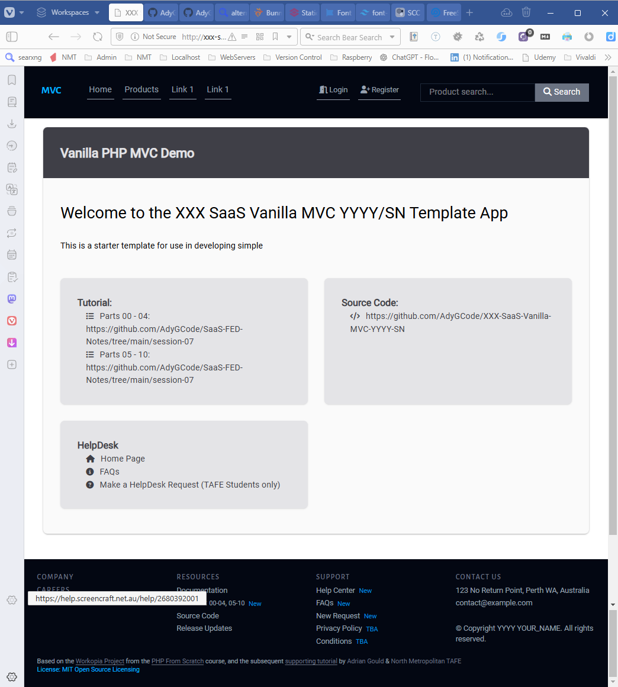

# XXX SaaS Vanilla MVC YYYY SN

<a name="readme-top" id="readme-top"></a>

Base Code for a Vanilla PHP Micro-MVC Framework.

Used by students at North Metropolitan TAFE for learning and assessment purposes.

#### Built With

[![Forks][forks-shield]][forks-url]
[![Downloads][downloads-shield]][downloads-url]

[![Languages][languages-shield]][languages-url]
[![Issues][issues-shield]][issues-url]

[![PHP][Php.com]][Php-url]
[![JS][Js.com]][Js-url]
[![Tailwindcss][Tailwindcss.com]][Tailwindcss-url]
[![PhpStorm][PhpStorm.com]][PhpStorm-url]


[![Educational Community Licence][licence-shield]][licence-url]

<p align="right">(<a href="#readme-top">back to top</a>)</p>


## Definitions

| Term                | Definition                                                                                                  |
|---------------------|-------------------------------------------------------------------------------------------------------------|
| BREAD               | Database operations to Browse, Read, Edit, Add and Delete data                                              |
| CRUD                | More commonly used term over BREAD. Create (Add), Retrieve (Browse/Read), Update (Edit) and Delete (Delete) |
| Relational Database | ...                                                                                                         |
| One to One          | ...                                                                                                         |
| One to Many         | ...                                                                                                         |
| Many to Many        | ...                                                                                                         |
| Polymorphism        | ...                                                                                                         |
| MVC                 | ...                                                                                                         |
| ...                 | ...                                                                                                         |

<p align="right">(<a href="#readme-top">back to top</a>)</p>

## Description

This small demonstration application was developed to assist in the
learning the process of developing a micro-framework.

This code is based on the [Workopia Project](https://github.com/bradtraversy/workopia-php)
Micro-MVC Framework from the [PHP From Scratch course](https://www.traversymedia.com/php-from-scratch),
and the subsequent [supporting tutorial](https://github.com/AdyGCode/SaaS-FED-Notes/tree/main/session-07)
by [Adrian Gould](https://adygcode.github.io/) & [North Metropolitan TAFE](https://www.northmetrotafe.wa.edu.au/)

<p align="right">(<a href="#readme-top">back to top</a>)</p>

## Table of Contents

TO DO: Add extra, or update the contents as needed, then remove this line.

- [Description](#description)
- [Definitions](#definitions)
- [Installation](#installation)
- [Usage](#usage)
- [Credits](#credits)
- [Licence](#licence)
- [Badges](#badges)
- [Features](#features)
- [Tests](#tests)
- [Contact](#contact)

## Installation

> **CLI Shell**
>
> Instructions are given using the BASH or Git-BASH CLI only.

> **Default Project Location**
>
> We presume you are using the bash shell within Windows Terminal and have a work folder called
`Source/Repos` in your account's
> root folder (eg. `/c/Users/YourName/Source/Repos`).

> **Project Naming Requirements**
>
> Replace
> - `XXX` with YOUR INITIALS,
> - `YYYY` with the current year and
> - `SN` with the current semester.
>
> For example: ajg-saas-vanilla-mvc-2025-s1

Clone the repository 
[xxx-saas-vanilla-mvc-yyyy-sn](https://github.com/AdyGCode/xxx-saas-vanilla-mvc-yyyy-sn) 
using the following commands.

```shell
cd $HOME/Source/Repos
git clone https://github.com/AdyGCode/xxx-saas-vanilla-mvc-yyyy-sn
```

Change into the folder and run the `composer` and `npm` installers:

```shell
cd xxx-saas-vanilla-mvc-yyyy-sn-YYYY-sN
composer install
composer update
npm install
```

If required, you may need to install CK Editor, Commonmark and HTML-to-Markdown using:

```shell
composer require ckeditor/ckeditor league/html-to-markdown league/commonmark
npm install @ckeditor/ckeditor5-build-classic
```

### Create RDBMS User & Database

Create the Database, Database user password, plus tables and seed data for your chosen RDBMS.

#### MariaDB and MySQL

Using PhpMyAdmin or a similar GUI based MySQL/RDBMS administration interface, execute the
provided SQL files for your DBMS.

#### PostgreSQL

TODO: Instructions for PostgreSQL are to be completed.

#### Links to SQL Scripts

| DBMS       | User & DB Script                                      |
|------------|-------------------------------------------------------|
| MariaDB    | [database-mariadb.sql](./config/database-mariadb.sql) |
| MariaDB    | [database-mysql.sql](./config/database-mysql.sql)     |
| PostgreSQL | [TODO: Not available](#)                              |


TODO: More details on use for use in developing basic application using this code.


<p align="right">(<a href="#readme-top">back to top</a>)</p>

## Usage

> TODO: Add details of how to use this demonstration application.




<p align="right">(<a href="#readme-top">back to top</a>)</p>

## Credits
 
- Font Awesome. (n.d.). Fontawesome.com. https://fontawesome.com
- PHP: Hypertext Preprocessor. (n.d.). Www.php.net. https://php.net
- TailwindCSS. (2023). Tailwind CSS - Rapidly build modern websites
  without ever leaving your HTML. Tailwindcss.com. https://tailwindcss.com/
- JetBrains (2019). PhpStorm. [online] JetBrains. Available
  at: https://www.jetbrains.com/phpstorm/.
- erusev/parsedown: Better Markdown Parser in PHP. (2019, December 30). 
  GitHub. https://github.com/erusev/parsedown
- ...


<p align="right">(<a href="#readme-top">back to top</a>)</p>

## Features

> Features may be added in the future

<p align="right">(<a href="#readme-top">back to top</a>)</p>

## Tests

> Tests to be developed


<p align="right">(<a href="#readme-top">back to top</a>)</p>

## Contact

Adrian Gould - Adrian.Gould@nmtafe.wa.edu.au

Project Link: https://github.com/AdyGCode/xxx-saas-vanilla-mvc-yyyy-sn

<p align="right">(<a href="#readme-top">back to top</a>)</p>

## Licence

Please see the [Educational Community License](License.md) for more details.

Any code based upon this project must also give the appropriate credit
both in the source code and also on any associated promotional, educational,
corporate or other materials both digital and non-digital.


<p align="right">(<a href="#readme-top">back to top</a>)</p>

## References & Further Study

- TODO: Add relevant references


<!-- MARKDOWN LINKS & IMAGES -->
<!-- https://www.markdownguide.org/basic-syntax/#reference-style-links -->

[forks-shield]: http://img.shields.io/github/forks/adygcode/xxx-saas-vanilla-mvc-yyyy-sn.svg?style=for-the-badge

[forks-url]: https://github.com/AdyGCode/xxx-saas-vanilla-mvc-yyyy-sn/network/members

[languages-shield]: http://img.shields.io/github/languages/count/adygcode/xxx-saas-vanilla-mvc-yyyy-sn.svg?style=for-the-badge

[languages-url]: https://github.com/AdyGCode/xxx-saas-vanilla-mvc-yyyy-sn/network/members

[downloads-shield]: http://img.shields.io/github/downloads/adygcode/xxx-saas-vanilla-mvc-yyyy-sn/total?style=for-the-badge

[downloads-url]: https://github.com/AdyGCode/xxx-saas-vanilla-mvc-yyyy-sn/network/members

[issues-shield]: http://img.shields.io/github/issues/adygcode/xxx-saas-vanilla-mvc-yyyy-sn.svg?style=for-the-badge

[issues-url]: https://github.com/adygcode/xxx-saas-vanilla-mvc-yyyy-sn/issues

[licence-shield]: https://img.shields.io/badge/opensourceinitiative-3DA639?style=for-the-badge

[licence-url]: https://github.com/adygcode/xxx-saas-vanilla-mvc-yyyy-sn/blob/main/License.md

[product-screenshot]: images/screenshot.png

[Laravel.com]: https://img.shields.io/badge/Laravel-FF2D20?style=for-the-badge&logo=laravel&logoColor=white

[Laravel-url]: https://laravel.com

[Tailwindcss.com]: https://img.shields.io/badge/Tailwindcss-06B6D4?style=for-the-badge&logo=tailwindcss&logoColor=white

[Tailwindcss-url]: https://tailwindcss.com

[Livewire.com]: https://img.shields.io/badge/Livewire-4E56A6?style=for-the-badge&logo=livewire&logoColor=white

[Livewire-url]: https://livewire.laravel.com

[Inertia.com]: https://img.shields.io/badge/Inertia-9553E9?style=for-the-badge&logo=inertia&logoColor=white

[Inertia-url]: https://inertiajs.com

[Php.com]: https://img.shields.io/badge/Php-777BB4?style=for-the-badge&logo=php&logoColor=white

[Php-url]: https://inertiajs.com

[PhpStorm.com]: https://img.shields.io/badge/Phpstorm-000000?style=for-the-badge&logo=phpstorm&logoColor=white

[PhpStorm-url]: https://jetbrains.com/phpstorm/
